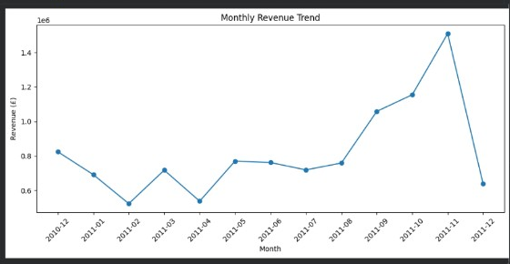
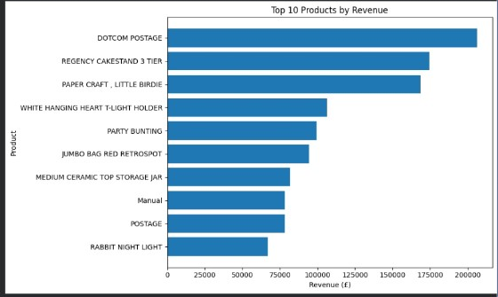
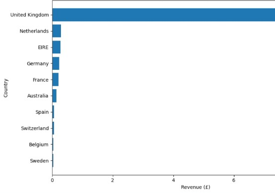
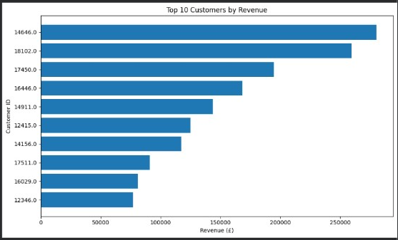

# E-Commerce Sales Analysis

## Project Overview

This project analyzes e-commerce sales data using Python, Pandas, and Matplotlib to identify sales trends, top-performing products, countries, and customers.

## Objectives

- Clean and prepare the sales dataset
- Calculate total revenue and order metrics
- Analyze monthly revenue trends
- Identify top 10 products by revenue
- Identify top 10 countries by revenue
- Identify top 10 customers by revenue
- Generate visualizations to understand sales performance
- Extract key business insights

## Tools & Technologies

- Python
- Pandas
- Matplotlib
- Jupyter Notebook / Google Colab

## Data Cleaning

The dataset was cleaned by:

- Removing rows with missing product descriptions
- Removing cancelled orders
- Removing invalid negative quantities
- Removing invalid prices
- Removing zero quantities and prices

## Key Results

- Total Revenue: £10.67M
- Total Orders: 19,960
- Total Customers: 4,338
- Average Order Value: £534.40
- November 2011 recorded the highest monthly revenue
- United Kingdom generated the highest revenue
- DOTCOM POSTAGE was the highest-revenue product

## Analysis Performed

### 1. Monthly Revenue Trend

Analyzed revenue across months to identify changes in sales performance.

### 2. Top 10 Products by Revenue

Identified the products generating the highest revenue.

### 3. Top 10 Countries by Revenue

Compared revenue generated across different countries.

### 4. Top 10 Customers by Revenue

Identified customers contributing the highest revenue.

## Key Insights

- The business generated approximately £10.67 million in revenue.
- The United Kingdom was the largest revenue-generating market.
- November 2011 had the highest monthly revenue.
- DOTCOM POSTAGE generated the highest product-level revenue.
- A small group of customers contributed significantly to total revenue.

## Conclusion

This analysis demonstrates how Python and data visualization can be used to understand e-commerce sales performance and identify important business trends.

## Project File

- `E_Commerce_Sales_Analysis.ipynb` - Complete analysis notebook
